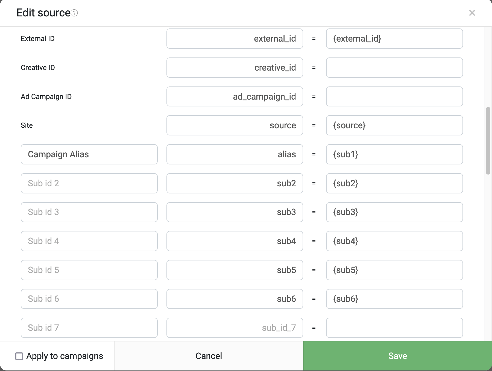

# Интеграция Keitaro с приложениями MIRA Apps от Playcash

## Оглавление
* [Введение](#introduction)
* [1. Создание источника трафика](#chapter-1)
* [2. Создание шаблона для офферов Playcash](#chapter-2)
* [3. Создание трек-ссылки](#chapter-3)
* [4. Настройка глобального постбека в PlayCash](#chapter-4)
* [Заключение](#conclusion)
* [Справочные материалы по теме](#docs)


## Введение <a name="introduction"></a>
В этом руководстве мы пошагово расскажем и покажем как интегрировать ваш Keitaro с ПП PlayCash в связке с приложениями Mira. Таким образом, у вас появится возможность лить трафик с FB/TT/InApp на приложения с оптимизацией на наши офферы, а статистику вы сможете получать в свой Keitaro.


## 1. Создание источника трафика <a name="chapter-1"></a>

* Откройте админку своего трекера. Перейдите во вкладку "**_Источники трафика_**" (_**Traffic Sources**_).
* Создайте новый источник трафика. Для этого кликните на кнопку "_**Создать**_" (_**Create**_). Откроется поп-ап с настройками источника. Назовите источник `Playcash | MIRA Apps Rent Service`
* Пропишите названия параметров URL и плейсхолдеров **в строгом соответствии** со списком ниже:
```
Name		|	Parameter	|	Placeholder or value
––––––––––––––––––––––––––––––––––––––––––––––––––––––––
Externa lID	|	external_id	=	{external_id}
Site		|	source		=	{source}
Campaign alias	|	alias		=	{sub1}
Sub id 2	|	sub2		=	{sub2}
Sub id 3	|	sub3		=	{sub3}
Sub id 4	|	sub4		=	{sub4}
Sub id 5	|	sub5		=	{sub5}
Sub id 6	|	sub6		=	{sub6}
PID		|	pid		=	{pid}
Offer ID	|	oid		=	{oid}
Landing ID	|	lid		=	{lid}
App ID		|	app_id		=	{app_id}
```

* Тут же в источнике трафика в поле "_**S2S постбэк**_" (_**S2S postback**_) вставьте ссылку из листинга ниже для отправки событий в источник трафика:
```
http://opti.mirarentapps.com?miclid={external_id}&status={status}&from=Playcash
```
* События для отправки установите "_**Лид**_" (_**Lead**_) и "_**Продажа**_" (_**Sale**_).
* Убедитесь что, что настройки правильны, сверившись со скриншотами ниже:

  
  
  

* Дополнительные материалы по теме приведены в [разделе Справочные материалы](#docs), пункт 4.


## 2. Создание шаблона для офферов Playcash <a name="chapter-2"></a>
Создание шаблона для наших офферов является обязательным условием, т.к. при сливе трафика в нейминге/диплинке вы будете указывать ваш ID в нашей ПП, а так же ID оффера и лендинга. Другие способы как завести оффер в трекер вы можете обсудить с нашим техническим специалистом в рабочем чате.
* _Примечание №1: если у вас уже добавлена наша ПП в трекере, можете пропустить шаг №1 и перейти к шагу №2._ Откройте админку своего трекера. Перейдите во вкладку "_**Партнерские сети**_" (_**Affiliate Networks**_). *Откроется поп-ап окно добавления новой ПП. В поле "_**Из шаблона**_" (_**From Template**_) введите "**Playcash**". Значения в выпадающем списке отфильтруются и в нем появится название нашей ПП. Выберите в списке нашу ПП. Нажмите на кнопку "_**Создать**_" (_**Create**_) в поп-апе. _Примечание №2: трекер при добавлении ПП сгенерирует Postback URL для отправки вам ПБ. Сохраните эту ссылку, инструкция по настройке глобального постбека находится в [разделе 4](#chapter-4)_. 
* Далее перейдите во кладку "_**Офферы**_" (_**Offers**_). Кликните на кнопку "_**Создать**_" (_**Create**_). Откроется поп-ап окно для создания оффера. Назовите оффер _**Playcash | track.way2pc.com/click? Template | MIRA Apps**_. В поле "_**Партнерская сеть**_" (_**Affiliate Network**_) укажите из выпадающего списка нашу ПП, добавленную в первом разделе этого мануала. На вкладке _**Redirect**_ в поле _**URL**_ укажите следующую ссылку:
```
https://track.way2pc.com/click?pid={pid}&offer_id={oid}&l={lid}&sub2={sub2}&sub3={sub3}&sub4={sub4}&sub5={sub5}&sub6={sub6}&sub7={app_id}&sub8={source}
```

* Проверьте все ли настроено корректно. Для этого сверьтесь с скриншотом ниже:


* Если все сделано правильно, кликните на кнопку "_**Сохранить**_" (_**Save**_).
* Дополнительные материалы по теме приведены в [разделе Справочные материалы](#docs), пункт 2.


## 3. Создание трек-ссылки <a name="chapter-3"></a>

* Создайте новую кампанию в трекере. Во вкладке "Кампании" (Campaigns) нажмите на кнопку "Создать" (Create).
* Укажите название кампании.
* В источнике трафика указываем ранее созданный вами источник _**Playcash | MIRA Apps Rent Service**_.
**ВНИМАНИЕ! Настоятельно рекомендуем использовать следующие настройки уникальности и ротации потоков в кампании для корректной работы кэширования ссылок внутри приложений. В случае, если настройки уникальности не соблюдены, возможны потери трафика.**
* **Важно! Обязательно настраиваем:**
    - Ротация потоков: "**_По весу_**" (**Weight-based**);
    - Привязать к: **_Потоки, лендинги и офферы_** (_**Flows, landing pages and offers**_);
    - Настройки уникальности: **_IP и User-Agent + Cookies_**;
    - Срок уникальности: **_8760 часов_**. 
* Создайте основной поток. Добавьте в него шаблон для офферов Playcash, который вы создали на предыдущем пункте этого мануала. Cсылка на справочную информацию о потоках в Keitaro приведена в [разделе Справочные материалы](#docs), пункт 3.
* Сверьте с примером настроенной кампании. Ниже приведен пример настроек вашей кампании:
   
* Кликните на кнопку "_**Создать**_" (_**Create**_). Скопируйте полученную ссылку. Далее все зависит от того нужен ли вам динамический алиас:
- Готовая ссылка будет выглядить так, если алиас остается статическим (весь трафик идет в одну кампанию в вашем трекере):
```
https://tds.domain/alias_example?external_id={external_id}&source={source}&alias={sub1}&sub2={sub2}&sub3={sub3}&sub4={sub4}&sub5={sub5}&sub6={sub6}&pid={pid}&oid={oid}&lid={lid}&app_id={app_id}
```
- Если же вы желаете получать из нейминга/диплинка в источнике трафика алиас (идентификатор) кампании и перенаправлять трафик сразу в конкретную кампанию, вы можете использовать для этого метку `sub1`. В таком случае готовая ссылка будет иметь следующий вид:
```
https://tds.domain/{sub1}?external_id={external_id}&source={source}&sub2={sub2}&sub3={sub3}&sub4={sub4}&sub5={sub5}&sub6={sub6}&pid={pid}&oid={oid}&lid={lid}&app_id={app_id}
```
**ВАЖНО: В таком случае во всех новых кампаниях для слива трафика с наших прил нужно указывать источник трафика, созданный в первом пункте данного мануала.****
Где `tds.domain` – доменное имя вашего трекера, используемое в кампании.
* Пришлите ссылку на кампанию наш рабочий чат. Дальнейшие настройки по интеграции проведет технический специалист ПП.


## 4. Настройка глобального постбека в PlayCash<a name="chapter-4"></a>
**[Мануал по настройке трекинг пикселя для Keitaro. Клик.](playcash-keitaro-tracking-pixel-setup.md)**


## Заключение <a name="conclusion"></a>
По итогам выполнения всех инструкций из данного мануала в вашем трекере должен быть:
1. Добавлен и настроен глобальный постбек;
2. Настроен и оформлен универсальный шаблон для слива трафика на наши офферы;
3. Настроен источник трафика MIRA Apps и сгенерирована трек-ссылка для слива трафика на приложения.
   Если у вас возникли какие-то вопросы или проблемы в процессе интеграции, пишите в рабочий чат с вашим персональным менеджером. Мы обязательно ответим на ваши вопросы и поможем решить проблемы, связанные с подготовкой к запуску трафика.

---

## Справочные материалы <a name="docs"></a>

1. [[docs.keitaro.io] Создание кампаний](https://docs.keitaro.io/ru/campaigns-and-streams/creating-campaign.html)
2. [[docs.keitaro.io] Создание оффера](https://docs.keitaro.io/ru/landing-pages-and-offers/creating-offer.html)
3. [[docs.keitaro.io] Настройка потоков в кампании](https://docs.keitaro.io/ru/campaigns-and-streams/streams.html)
4. [[docs.keitaro.io] Добавление партнерских сетей](https://docs.keitaro.io/ru/conversions-and-postback/adding-affiliate-networks.html)


