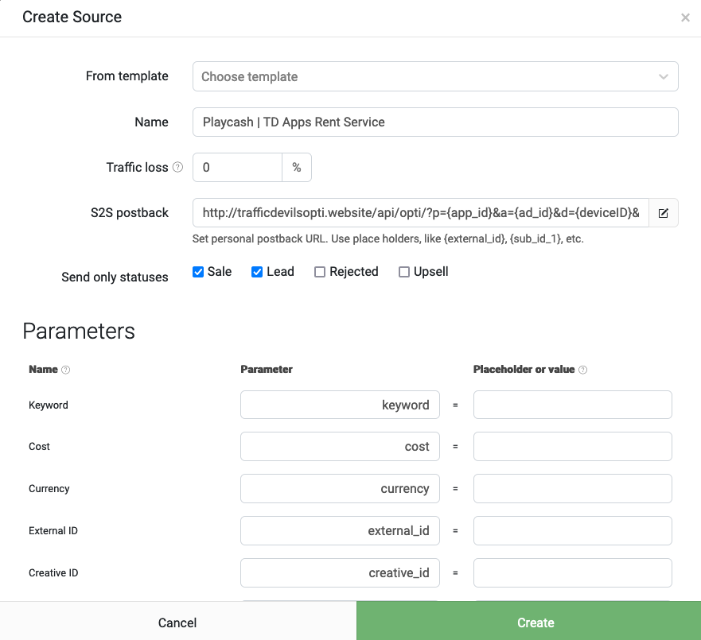
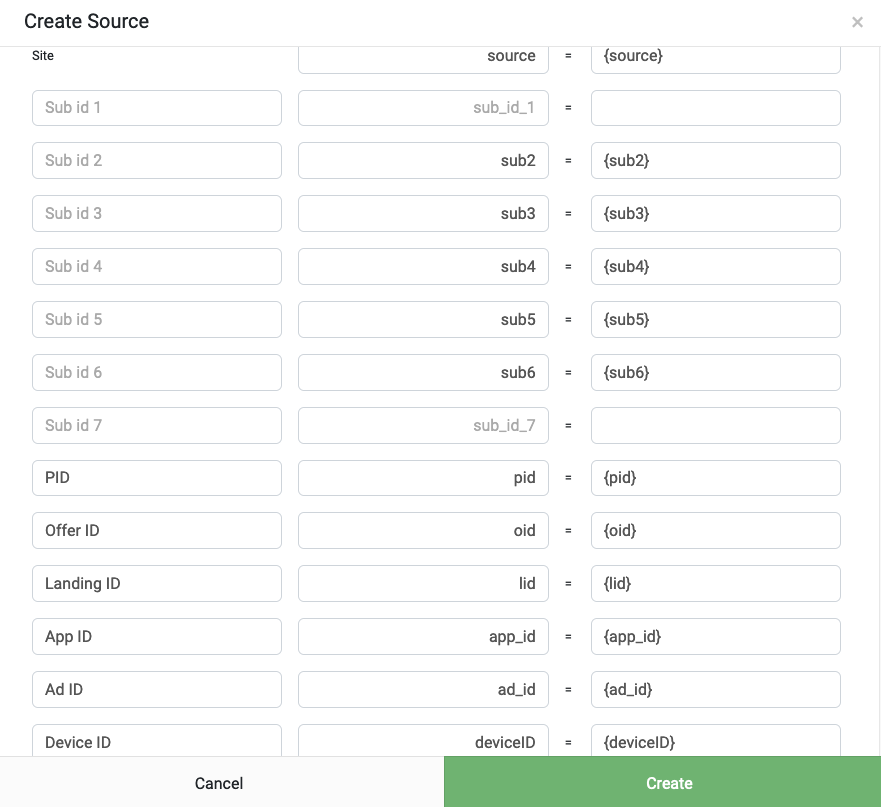
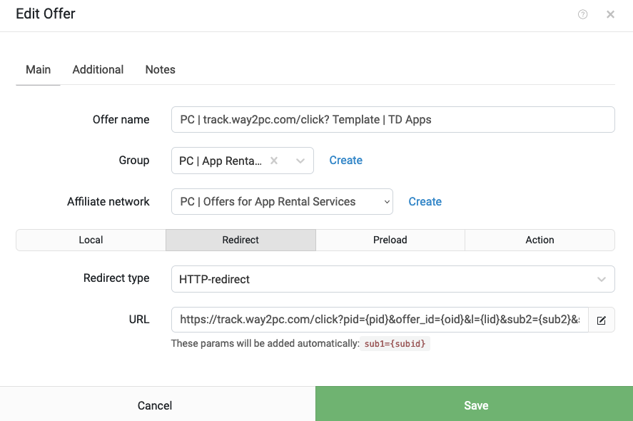
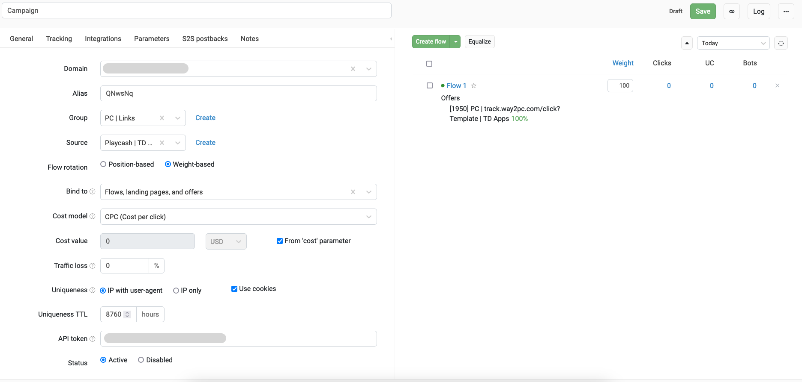
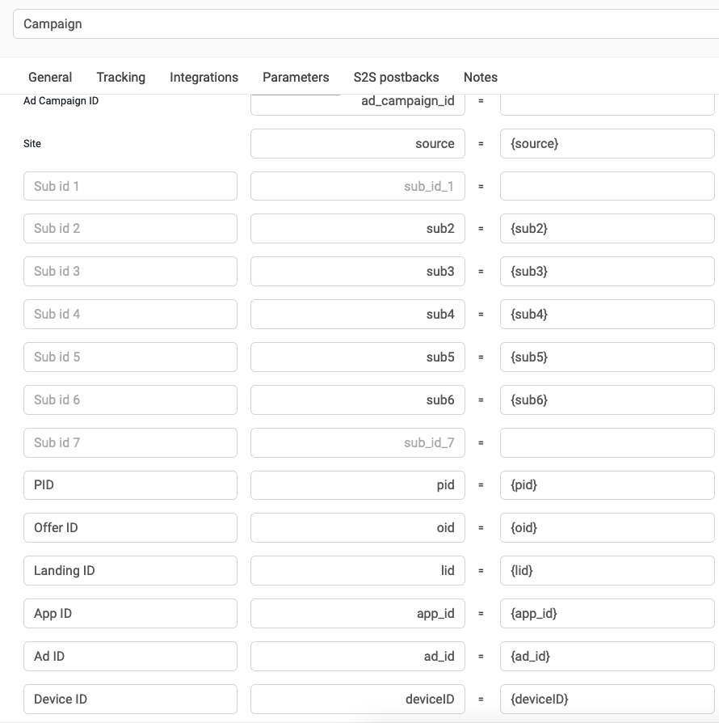

# Guide Integration Keitaro with MIRA Apps from PlayCash

## Оглавление
* [Введение](#introduction)
* [1. Создание источника трафика](#chapter-1)
* [2. Создание шаблона для офферов Playcash](#chapter-2)
* [3. Создание трек-ссылки](#chapter-3)
* [4. Настройка глобального постбека в PlayCash](#chapter-4)
* [Заключение](#conclusion)
* [Справочные материалы по теме](#docs)


## Введение <a name="introduction"></a>
В этом руководстве мы пошагово расскажем и покажем как интегрировать ваш Keitaro с ПП PlayCash в связке с приложениями Traffic Devils Apps. Таким образом, у вас появится возможность лить трафик с FB/TT/InApp на приложения с оптимизацией на наши офферы, а статистику вы сможете получать в свой Keitaro.


## 1. Создание источника трафика <a name="chapter-1"></a>

1. Откройте админку своего трекера. Перейдите во вкладку "_Источники трафика_" (_Traffic Sources_).
2. Создайте новый источник трафика. Для этого кликните на кнопку "_Создать_" (_Create_). Откроется поп-ап с настройками источника. Назовите источник `Playcash | TD Apps Rent Service`
3. Пропишите названия параметров URL и плейсхолдеров **в строгом соответствии** со списком ниже:
```
Name        |     Parameter   |     Placeholder or value
––––––––––––––––––––––––––––––––––––––––––––––––––––––––
Site        |     source      =     {source}
Alias       |     sub2        =     {sub2}
Sub id 3    |     sub3        =     {sub3}
Sub id 4    |     sub4        =     {sub4}
Sub id 5    |     sub5        =     {sub5}
Sub id 6    |     sub6        =     {sub6}
PID         |     pid         =     {pid}
Offer ID    |     oid         =     {oid}
Landing ID  |     lid         =     {lid}
App ID      |     app_id      =     {app_id}
Ad ID       |     ad_id       =     {ad_id}
Device ID   |     deviceID    =     {deviceID}
```

4. Тут же в источнике трафика в поле "_S2S постбэк_" (_S2S postback_) вставьте ссылку из листинга ниже для отправки событий в источник трафика:
```
http://trafficdevilsopti.website/api/opti/?p={app_id}&a={ad_id}&d={deviceID}&e={status: lead=reg sale=dep}&c={status: lead= sale=30}&w=PlayCash
```
5. События для отправки установите "_Лид_" (_Lead_) и "_Продажа_" (_Sale_).
6. Убедитесь что, что настройки правильны, сверившись со скриншотами ниже:






7. Дополнительные материалы по теме приведены в [разделе Справочные материалы](#docs), пункт 4.


## 2. Создание шаблона для офферов Playcash <a name="chapter-2"></a>
Создание шаблона для наших офферов является обязательным условием, т.к. при сливе трафика в нейминге/диплинке вы будете указывать ваш ID в нашей ПП, а так же ID оффера и лендинга. Другие способы как завести оффер в трекер вы можете обсудить с нашим техническим специалистом в рабочем чате.
1. _Примечание №1: если у вас уже добавлена наша ПП в трекере, можете пропустить шаг №1 и перейти к шагу №2._ Откройте админку своего трекера. Перейдите во вкладку "_Партнерские сети_" (_Affiliate Networks_).
2. Откроется поп-ап окно добавления новой ПП. В поле "_Из шаблона_" (_From Template_) введите "**Playcash**". Значения в выпадающем списке отфильтруются и в нем появится название нашей ПП. Выберите в списке нашу ПП. Нажмите на кнопку "_Создать_" (_Create_) в поп-апе. _Примечание №2: трекер при добавлении ПП сгенерирует Postback URL для отправки вам ПБ. Сохраните эту ссылку, инструкция по настройке глобального постбека находится в [разделе 4](#chapter-4)_.
3. Далее перейдите во кладку "_Офферы_" (_Offers_). Кликните на кнопку "_Создать_" (_Create_). Откроется поп-ап окно для создания оффера. Назовите оффер _Playcash | track.way2pc.com/click? Template | MIRA Apps_. В поле "_Партнерская сеть_" (_Affiliate Network_) укажите из выпадающего списка нашу ПП, добавленную в первом разделе этого мануала. На вкладке _Redirect_ в поле _URL_ укажите следующую ссылку:
```
https://track.way2pc.com/click?pid={pid}&offer_id={oid}&l={lid}&sub2={sub2}&sub3={sub3}&sub4={sub4}&sub5={sub5}&sub6={sub6}&sub7={app_id}&sub8={source}
```

4. Проверьте все ли настроено корректно. Для этого сверьтесь с скриншотом ниже:



5. Если все сделано правильно, кликните на кнопку "_Сохранить_" (_Save_).
6. Дополнительные материалы по теме приведены в [разделе Справочные материалы](#docs), пункт 2.


## 3. Создание трек-ссылки <a name="chapter-3"></a>

1. Создайте новую кампанию в трекере. Во вкладке "Кампании" (Campaigns) нажмите на кнопку "Создать" (Create).
2. Укажите название кампании.
3. В источнике трафика указываем ранее созданный вами источник _Playcash | TD Apps Rent Service_.
> [!WARNING]
> ВНИМАНИЕ! Настоятельно рекомендуем использовать следующие настройки уникальности и ротации потоков в кампании для корректной работы кэширования ссылок внутри приложений. В случае, если настройки уникальности не соблюдены, возможны потери трафика.
4. **Важно! Обязательно настраиваем:**
    - Ротация потоков: "**По весу**".
    - Привязать к: **Потоки, лендинги и офферы.**
    - Настройки уникальности: **IP и User-Agent + Cookies**.
    - Срок уникальности: **8760 часов**.
5. Создайте основной поток. Добавьте в него шаблон для офферов Playcash, который вы создали на предыдущем пункте этого мануала. Cсылка на справочную информацию о потоках в Keitaro приведена в [разделе Справочные материалы](#docs), пункт 3.
6. Сверьте с примером настроенной кампании. Ниже приведен пример настроек вашей кампании:
   
   
7. Кликните на кнопку "_Создать_" (_Create_). Скопируйте полученную ссылку. Далее все зависит от того нужен ли вам динамический алиас:
- Готовая ссылка будет выглядить так, если алиас остается статическим (весь трафик идет в одну кампанию в вашем трекере):
```
https://tds.domain/alias_example?source={source}&sub2={sub2}&sub3={sub3}&sub4={sub4}&sub5={sub5}&sub6={sub6}&pid={pid}&oid={oid}&lid={lid}&app_id={app_id}&ad_id={ad_id}&deviceID={deviceID}
```
- Если же вы желаете получать из нейминга/диплинка в источнике трафика алиас (идентификатор) кампании и перенаправлять трафик сразу в конкретную кампанию, вы можете использовать для этого метку `sub1`. В таком случае готовая ссылка будет иметь следующий вид:
> [!NOTE]
> **ВАЖНО: В таком случае во всех новых кампаниях для слива трафика с наших прил нужно указывать источник трафика, созданный в первом пункте данного мануала.**
```
https://tds.domain/{sub2}?source={source}&sub3={sub3}&sub4={sub4}&sub5={sub5}&sub6={sub6}&pid={pid}&oid={oid}&lid={lid}&app_id={app_id}&ad_id={ad_id}&deviceID={deviceID}
```
Где `tds.domain` – доменное имя вашего трекера, используемое в кампании.
8. Пришлите ссылку на кампанию наш рабочий чат. Дальнейшие настройки по интеграции проведет технический специалист ПП.


## 4. Настройка глобального постбека в PlayCash<a name="chapter-4"></a>
**[Мануал по настройке трекинг пикселя для Keitaro. Клик.](placash-keitaro-tracking-pixel-setup.md)**


## Заключение <a name="conclusion"></a>
По итогам выполнения всех инструкций из данного мануала в вашем трекере должен быть:
1. Добавлен и настроен глобальный постбек;
2. Настроен и оформлен универсальный шаблон для слива трафика на наши офферы;
3. Настроен источник трафика TD Apps и сгенерирована трек-ссылка для слива трафика на приложения.
   Если у вас возникли какие-то вопросы или проблемы в процессе интеграции, пишите в рабочий чат с вашим персональным менеджером. Мы обязательно ответим на ваши вопросы и поможем решить проблемы, связанные с подготовкой к запуску трафика.

Также рекомендуем подписаться на наши ресурсы, а именно:
- [Telegram канал](https://t.me/PlayCashNetwork)
- [Telegram чат](https://t.me/playcashchat)
- [Страница в Instagram](https://www.instagram.com/playcash.network/)
- [Страница в Facebook](https://www.facebook.com/PlayCash-Gambling-Betting-Affiliate-Network-109938504205885/)
- [Страница в X (бывший Twitter)](https://twitter.com/PlayCashNetwork)

---

## Справочные материалы <a name="docs"></a>

1. [[docs.keitaro.io] Создание кампаний](https://docs.keitaro.io/ru/campaigns-and-streams/creating-campaign.html)
2. [[docs.keitaro.io] Создание оффера](https://docs.keitaro.io/ru/landing-pages-and-offers/creating-offer.html)
3. [[docs.keitaro.io] Настройка потоков в кампании](https://docs.keitaro.io/ru/campaigns-and-streams/streams.html)
4. [[docs.keitaro.io] Добавление партнерских сетей](https://docs.keitaro.io/ru/conversions-and-postback/adding-affiliate-networks.html)


